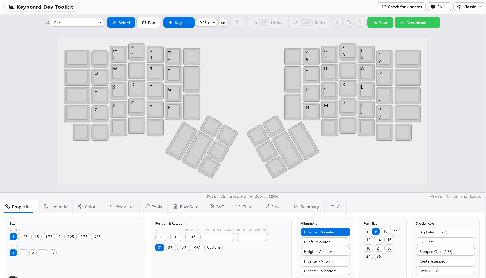
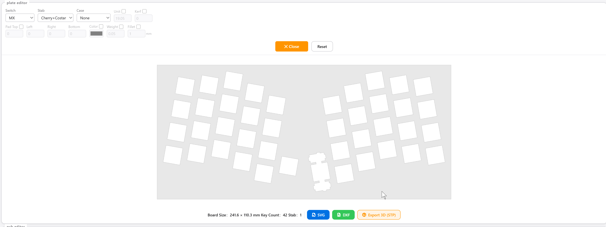
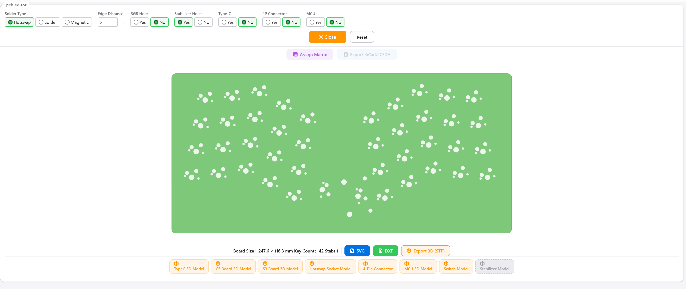

# Keyboard Dev Toolkit

> All-in-one custom keyboard design tool — from layout to PCB, entirely in your browser. Draw your layout, generate the plate, generate the PCB, and export production-ready files. Your designs never leave your computer.

**KLE-compatible · 100% client-side · zero upload, zero telemetry · free & open source**

---

## What is this?

Keyboard Dev Toolkit is a **keyboard design tool that runs in your browser**. Whether you're building a one-off custom keyboard for yourself or prototyping a PCB for mass production, the whole pipeline lives in one place:

1. **Draw the layout** — drag-and-drop key placement like KLE, with rotated clusters, stepped/homing/decal keys and more
2. **Generate the plate** — one-click plate geometry, exported as DXF for CNC / laser cutting
3. **Generate the PCB** — automatic switch/stabilizer/mounting-hole placement, exported to KiCad / LCEDA for fabrication
4. **Output firmware** — Pro edition generates QMK firmware source (keyboard.json / keymap.c / VIA) — draw it, then flash it

> Everything is computed **locally in your browser**. There is no server, no upload, no telemetry — your unreleased designs stay on your machine.

## Why this tool

| Pain point | How we solve it |
|-----------|-----------------|
| KLE only draws layouts — no structural output | Plates and PCBs are generated automatically, turning drawings into manufacturable files |
| Fear of leaking unreleased designs | 100% client-side: zero upload, zero telemetry, works offline |
| High switching costs to new tools | Fully KLE-compatible — import your existing layouts and migrate with zero friction |
| "Free" tools that are painful to use | Modern UI (Next.js / React): marquee select, drag, zoom/pan, undo/redo, context menus, 9 UI languages |
| Fragmented file formats | Unified exports: JSON / SVG / PNG / JPG / DXF / STEP / KiCad / LCEDA / QMK |

## Features

### 🎨 Layout editor (keyboard canvas)
Full layout editing: 12 label slots, rotated key clusters, stepped/homing/decal keys, per-key colors and textures, marquee selection, drag, zoom/pan, context menu, undo/redo, 9 UI languages.



### 🧩 Plate editor
Auto-generates plate geometry from your layout: per-key cutout size and rotation, screw mounting holes, DXF export ready for CNC / laser cutting.



### 🔌 PCB editor
Auto-generates the PCB: switch footprints, stabilizer cutouts, mounting holes, and matrix wiring assignment (shared `matrix-core` engine with orphan-key detection) — export to KiCad or continue in LCEDA (立创EDA) for routing and fabrication.



## Who is it for?

- **Custom keyboard enthusiasts** — design your own layout and get a machinable plate
- **Keyboard makers & indie developers** — from drawing to PCB to firmware, one tool
- **Small studios / startups** — fast prototyping before mass production; change the layout and the PCB follows
- **AI & automation workflows** — fully client-side, standard JSON data format, scriptable and callable by AI tools

## Getting started

### 🌐 Online (try it first)

Use the hosted web version directly in your browser — no installation needed (all free features included).

### 🖥️ Desktop app (coming soon)

Windows installer (`.exe`) will be published on the [Releases](https://github.com/709208969/keyboard-dev-toolkit/releases) page: double-click to install, works offline, opens local files directly. Watch the Releases page for updates.

### 🛠️ Run locally (developers)

```bash
npm install     # postinstall injects community stubs automatically
npm run dev     # open http://localhost:3000
```

Build & test:

```bash
npm run check             # lint + typecheck + production build
npx vitest run tests/     # unit tests (443+ cases)
```

## Free vs Pro

| Feature | Community (this repo / web) | Pro |
|---------|:---:|:---:|
| Layout editor (12 label slots, rotated clusters, stepped keys, etc.) | ✅ | ✅ |
| Plate generation + DXF export | ✅ | ✅ |
| PCB generation (switches / stabilizers / mounting holes) | ✅ | ✅ |
| Export JSON / SVG / PNG / JPG | ✅ | ✅ |
| STEP 3D model export | ✅ | ✅ |
| **KiCad `.kicad_pcb` export** | 🔒 | ✅ |
| **LCEDA (立创EDA) import workflow** | 🔒 | ✅ |
| **QMK firmware source generation** (keyboard.json / keymap.c / VIA) | 🔒 | ✅ |
| Manufacturing order pipeline (coming soon) | — | ✅ |

The Community Edition is free and open source (AGPL-3.0). Pro-only modules are physical placeholders (`pro-stub/`) in this repo — real implementations are injected at build time from a private repository, so proprietary code can never leak into this repo.

## Architecture (for AI & developers)

- **Stack**: Next.js 16 / React 19 / TypeScript 5 / Tailwind v4 + Tauri v2 (Rust) desktop shell
- **100% client-side**: static export, no backend, no server, works offline
- **Data flow**: `KLE JSON / URL hash(##@@) / localStorage → parseKLE → KeyProps[] → editorReducer (undo/redo) → canvas & generators → multi-format export`
- **matrix-core**: geometry → matrix assignment engine (with orphan-key detection), shared by PCB preview, KiCad and QMK pipelines
- **Compatibility**: bidirectional KLE data format — paste KLE JSON or share links directly in/out
- **Testing**: 443+ unit tests (incl. KLE round-trip snapshots) + Playwright E2E
- **i18n**: 9 languages built in

## FAQ

**Q: Can I import my existing KLE layouts?**
A: Yes. KLE JSON or URL share links import directly — no conversion needed.

**Q: Is my design data safe?**
A: Yes. The app runs 100% locally in your browser — there is no server, so your data is never uploaded.

**Q: Can the exported files go straight to a fab?**
A: Plate DXF is machinable directly; for PCB, finish routing via the KiCad / LCEDA workflow and submit for fabrication.

## Contributing

PRs welcome! By opening a pull request you agree that your contribution is licensed under **AGPL-3.0**, and grant the maintainer a right to relicense future combined works (keeps dual-licensing possible). Please run `npm run check` before submitting.

Good first issues: i18n strings (9 languages), canvas rendering performance, export format coverage.

## License & Trademark

- Code: **[GNU Affero General Public License v3.0](./LICENSE)** (AGPL-3.0-only). Any derivative — including hosted services — must be released under AGPL.
- "Keyboard Dev Toolkit", the K星 logo and wordmarks are trademarks of the K星团队. Forks must rename the product and may not present themselves as the original.
- KLE format compatibility is independent of keyboard-layout-editor.com; that site is not affiliated with this project. Thanks to Ian Prest and the KLE community for the original inspiration.

---

## 中文简介

键盘配列编辑器（兼容 KLE 数据格式）+ 键盘 PCB / 定位板自动生成工具，**100% 本地运行，设计永不离开你的电脑**。

- 社区版（本仓库）：编辑器 + 定位板/PCB 生成 + DXF/STEP 导出，AGPL-3.0 开源
- 专业版：KiCad / 立创EDA / QMK 固件生产级导出
- Windows 安装版（.exe）即将在 Releases 发布，敬请关注
- 快速上手：`npm install && npm run dev`，或直接使用在线版本
